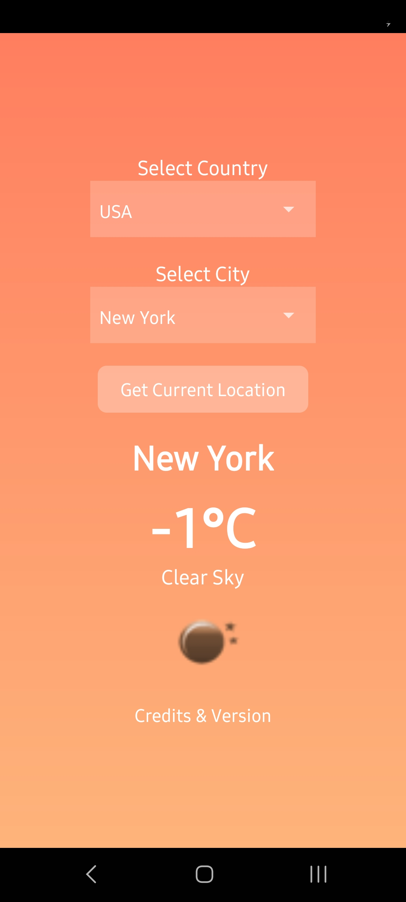
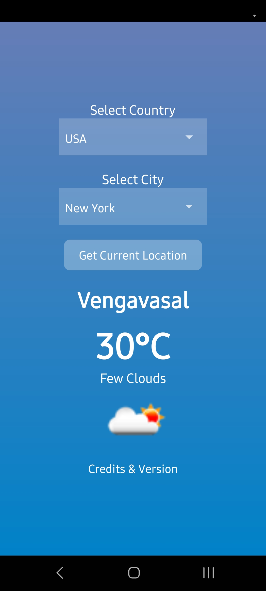

# Weather App

A simple and elegant weather application built using React Native. The app provides real-time weather updates, supports dark mode, and has a clean, minimalist UI.

## Features
- **Real-time Weather Updates**: Fetches live weather data using a weather API.
- **Dark Mode Support**: Automatically adjusts based on system theme.
- **Minimalist UI**: Designed for a clean and simple user experience.
- **Version Info & Credits**: Displays app version and credits.
## Screenshots

### 🌤️ Home Screen

  
  

## Download APK
[Click here to download the APK](https://drive.google.com/file/d/1bwpzcF1bNlxWJoTTAwMqsxr_Iq7vh2KG/view?usp=drive_link)

## Credits
- **Weather API**: Powered by [OpenWeatherMap](https://openweathermap.org/)
- **Icons**: [Weather icons created by Freepik - Flaticon](https://www.flaticon.com/free-icons/weather)

